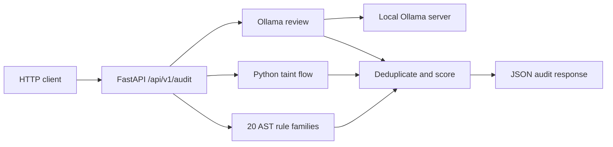
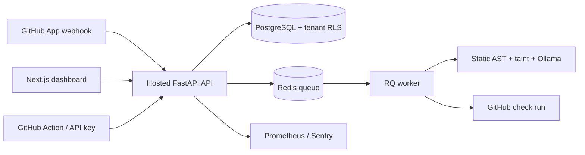

# AIGuardian

[](https://github.com/Balerion769/ai-guardian/actions/workflows/ai-guardian.yml) [](vscode-extension/README.md) [](dashboard/web/README.md)

AIGuardian is a local code security audit API. Send it a Git patch or code snippet and it combines syntax-tree rules, a small Python taint pass, and a review from a locally running Ollama model. It returns findings, a risk score, and a `PASSED` or `FAILED` result.

Local mode has no authentication, database, or web UI. Hosted mode adds GitHub sign-in, organization-scoped API keys, PostgreSQL audit history, Redis workers, and statistics. Submitted code is sent to the configured Ollama endpoint, which defaults to your machine in local mode. The local API applies a 60-request-per-minute limit per client IP.

## How it works



The scanner inspects added lines in a Git patch, or every line of a plain snippet. Equivalent findings at the same line are combined, keeping the higher severity. Each `HIGH` adds 40 risk points, `MEDIUM` adds 15, and `LOW` adds 5; a proven taint flow adds 10. Scores cap at 100. Findings in test/example paths are downgraded one severity level. Any retained `HIGH` makes the status `FAILED`; otherwise it is `PASSED`. See the [system design](docs/architecture.md) for the modules, data flow, and failure behavior.

## Hosted Version

The hosted dashboard in [`dashboard/web`](dashboard/web/README.md) provides GitHub OAuth, organization-scoped API keys, PostgreSQL audit history, Redis workers, Stripe plans, GitHub App pull-request checks, and Prometheus/Sentry observability. Deploy it with [`docker-compose.prod.yml`](docker-compose.prod.yml) using the [deployment guide](DEPLOY.md). The dashboard is designed to run behind your own HTTPS domain; this repository does not claim a hosted public URL.



## Requirements

- Python 3.11 or newer
- [Ollama](https://ollama.com/download) with the selected model downloaded
- Enough disk space and memory for that model

The default model is `qwen2.5-coder`. Python dependencies are listed in `requirements.txt`.

## Run locally

Clone the repository and enter its directory:

```bash
git clone https://github.com/Balerion769/ai-guardian.git
cd ai-guardian
```

Create a virtual environment and install dependencies.

**macOS / Linux**

```bash
python3 -m venv .venv
source .venv/bin/activate
python -m pip install -r requirements.txt
```

**Windows PowerShell**

```powershell
py -3 -m venv .venv
.venv\Scripts\Activate.ps1
python -m pip install -r requirements.txt
```

Install Ollama, then download the default model:

```bash
ollama pull qwen2.5-coder
```

Start Ollama if it is not already running as a background service:

```bash
ollama serve
```

In a separate terminal, with the virtual environment active, start the API:

```bash
uvicorn main:app --host 127.0.0.1 --port 8000
```

Open <http://127.0.0.1:8000/docs> for interactive API documentation.

### Configuration

| Variable | Default | Purpose |
| --- | --- | --- |
| `OLLAMA_URL` | `http://localhost:11434/api/generate` | Ollama generation endpoint |
| `OLLAMA_MODEL` | `qwen2.5-coder` | Installed Ollama model name |
| `OLLAMA_TIMEOUT_SECONDS` | `5` | Positive response budget in seconds, capped at 5 for the entire model stage |

For example, to use another installed model in PowerShell:

```powershell
ollama pull qwen3-coder:30b
$env:OLLAMA_MODEL = 'qwen3-coder:30b'
uvicorn main:app --host 127.0.0.1 --port 8000
```

On macOS / Linux, set it with `export OLLAMA_MODEL=qwen3-coder:30b` before starting Uvicorn. A larger model needs more resources and may need a longer timeout.

## Use the API

`POST /api/v1/audit` accepts JSON with two required strings:

| Field | Meaning |
| --- | --- |
| `diff_content` | Nonblank Git patch or code snippet, at most 200,000 characters and 2,000 added lines |
| `language` | Nonblank language label, at most 50 characters |

The static parser supports `python`, `javascript`, `typescript`, and `env`/`dotenv` assignments (and short aliases); `language` also gives Ollama context. Undeclared fields and invalid types are rejected. Inputs over 2,000 added lines receive HTTP `413`.

**macOS / Linux**

```bash
curl -X POST http://127.0.0.1:8000/api/v1/audit \
  -H 'Content-Type: application/json' \
  -d '{"diff_content":"eval(user_input)","language":"python"}'
```

**Windows PowerShell**

```powershell
$body = @{ diff_content = 'eval(user_input)'; language = 'python' } | ConvertTo-Json
Invoke-RestMethod -Uri 'http://127.0.0.1:8000/api/v1/audit' -Method Post -ContentType 'application/json' -Body $body
```

To audit unstaged Git changes in PowerShell, put the patch in `diff_content`:

```powershell
$patch = git diff --no-ext-diff -- .
$body = @{ diff_content = ($patch -join "`n"); language = 'python' } | ConvertTo-Json
Invoke-RestMethod -Uri 'http://127.0.0.1:8000/api/v1/audit' -Method Post -ContentType 'application/json' -Body $body
```

The patch must be nonempty. Use `git diff --cached` for staged changes.

A response can look like this; Ollama findings can vary:

```json
{
  "status": "FAILED",
  "risk_score": 40,
  "vulnerabilities": [
    {
      "severity": "HIGH",
      "category": "Unsafe Code Execution",
      "description": "Dynamic code execution may run untrusted input.",
      "line_reference": "Line 1",
      "remediation": "Use data = json.loads(user_input) or explicit dispatch instead of eval().",
      "confidence": 1.0,
      "tainted": false
    }
  ],
  "summary": "Found 1 security finding(s).",
  "static_count": 1,
  "ai_count": 0,
  "latency_ms": 12.4,
  "model_used": "qwen2.5-coder"
}
```

Ollama connection, timeout, or HTTP errors return available static findings with an incomplete-analysis note in `summary`. HTTP `503` is reserved for simultaneous static and model failure. The model stage has a five-second total deadline. Every model finding must include a Pydantic-validated confidence value; findings below `0.6` are dropped. Invalid model output gets up to three repair prompts; if every response remains invalid, the API returns a `FAILED` audit with a `HIGH` severity `Analysis Incomplete` finding.

`GET /health` returns process status and the configured model name. `GET /metrics` returns process-local audit and finding counters. Neither endpoint proves that Ollama is currently responding.

## Tests

With the virtual environment active, install the test dependency and run pytest:

```bash
python -m pip install -r requirements-dev.txt
python -m pytest -q
```

Tests use a mock Ollama transport and do not require a running model.

## GitHub Action

The composite Action audits changed files on a GitHub runner, prints a source-safe Markdown table, and can comment on a PR. See the [installation and workflow guide](docs/github-action.md). The published root entry point is `uses: Balerion769/ai-guardian@v1` once a `v1` tag is pushed; the current repository also contains the requested nested action under `.github/actions/ai-guardian/`.

## Hosted backend

Run `docker compose up --build -d` to start PostgreSQL, Redis, a schema initializer, the hosted API on `127.0.0.1:8001`, and an audit worker. See the [hosted setup guide](docs/hosted-backend.md) for GitHub OAuth configuration, organization and key creation, and production secrets. The existing local service remains on port 8000. Hosted `POST /api/v1/audit` requires `X-API-Key` and returns an audit ID immediately, with findings when processing finishes within two seconds. `python -m dashboard.smoke` inside the API container runs a development-only end-to-end check and removes its synthetic data.

To sample 50 labeled official OWASP BenchmarkPython v0.1 cases (25 vulnerable and 25 safe), run `python -m tests.owasp_benchmark`. This downloads source and labels from the [OWASP BenchmarkPython repository](https://github.com/OWASP-Benchmark/BenchmarkPython) at pinned commit `f1291485808b66e20ddb6b01b10dc71b3df8c8ba`, uses static and taint analysis only, and prints a precision/recall table. It requires network access. On the sampled seed-42 set in this environment, static precision was `0.833` and recall was `0.200` (5 TP, 1 FP, 20 FN, 24 TN); this is a limited sample, not a production accuracy claim.

## Current limits and safe use

- The Next.js dashboard in `dashboard/web/` runs on port 3000 and offers synthetic demo data only in development when GitHub OAuth is not configured. Real sign-in needs a GitHub OAuth app, a `NEXTAUTH_SECRET`, and the hosted API. The web client uses a server-side session proxy, so API keys are only displayed once and are never placed in browser storage. The dashboard can show diffs only when an audit links to a GitHub PR or commit; the backend fetches these on demand and limits display to 200,000 bytes. See [dashboard setup](dashboard/web/README.md).
- The requested Next.js 14 release has unresolved upstream security advisories: `npm audit --omit=dev` reports one critical and one high dependency issue. The local demo binds to `127.0.0.1`; upgrade the dashboard to a supported patched Next.js major and rerun the audit before exposing it publicly.
- The repository trend view uses at most 200 audits over 90 days per request; large organizations need paginated or pre-aggregated repository trends. Stripe Checkout, customer portal, invoices, and webhook upgrades need configured Stripe test or live credentials. The local billing demo uses synthetic data only.
- Billing enforces daily quotas (Free 100, Pro 1,000, Team unlimited), three repositories and one owned organization on Free, and paid seat counts. An hourly service removes audit metadata and findings older than seven days on Free/Pro or 90 days on Team. SSO, SOC 2 exports, custom rules, Slack delivery, and automatic fixes are planned features and are not available yet.
- Hosted GitHub OAuth cannot work until an OAuth app ID and secret are configured. The Docker Compose defaults are only for loopback development; change database/session/encryption secrets, enable HTTPS, and set `DASHBOARD_DEV_MODE=0` before exposing the service. The worker sends source to `OLLAMA_URL`, which may be a remote host if configured.
- Hosted jobs place source temporarily in private Redis. No source is stored in audit rows or logs. If Redis is unavailable, submission returns 503 and the attempted audit is marked `ERROR`. GitHub commit statuses block a PR only when branch protection requires the `AI Guardian` context.
- Hosted schema creation is idempotent for the initial deployment; later schema changes need versioned migrations. OAuth access tokens may expire or be revoked and require signing in again. Statistics use SQL aggregates, with a SQLite-only test fallback for remediation time.
- The VS Code extension in `vscode-extension/` audits Python, JavaScript, and TypeScript files on save or command. Files above 200,000 characters are skipped; files of 500 lines or more send only a 200-line window around the visible editor area. If the API is unavailable, five heuristic offline checks run, with possible false positives and lower coverage. The default API URL is local; configuring a remote URL sends source to that server. Only two offline patterns offer automatic edits; review each fix before applying it.
- Its `vscode-extension/.vscode/launch.json` compiles and starts an Extension Development Host when F5 is pressed from the extension workspace. An offline sample can be tested without Ollama; full model findings require the local API and Ollama to be running.
- Static rules parse Python with `ast` and JavaScript/TypeScript with tree-sitter. JavaScript falls back to esprima if tree-sitter cannot load; TypeScript needs tree-sitter. Twenty rule families cover selected injection, secret, deserialization, crypto, CORS, TLS, permissions, and file-handling patterns. Python taint tracking handles direct sources and local assignments. These are heuristic rules, not a complete security scanner.
- Static parsing examines small windows around changed lines for speed. Complex statements spanning many lines or incomplete Git hunks can be missed. Unsupported languages currently receive no static findings and still go to Ollama.
- Patches keep file names in finding references. When more than 128 suspicious lines appear in one request, the static pass samples across them, caps its output, and adds a high-severity `Analysis Incomplete` finding. Split large dense changes into smaller audits.
- On this Windows Python 3.14 environment, a 200,000-character benign Python input scanned in 147 ms and a dense `eval` input in 59 ms. These are local measurements, not a cross-machine latency guarantee.
- If tree-sitter is unavailable, JavaScript uses esprima. Esprima cannot parse TypeScript type syntax; that fallback reports `Analysis Incomplete` instead of silently passing the change.
- The five-second Ollama deadline bounds waiting time; it cannot guarantee a model response in five seconds. Large or cold models may leave the response with static findings only.
- The model can miss issues or report false positives. Review findings before acting on them.
- A clean result means this tool found no issue in the submitted input. It is not a security guarantee.
- The local scanner API has no authentication or TLS. Its in-process rate limit is 60 requests per minute per IP and resets on restart. Keep it bound to `127.0.0.1` or another trusted interface; use an authenticated reverse proxy before exposing it. Hosted mode requires an API key for audit submission and a GitHub session for organization data.
- The 50-case OWASP sample found only 5 of 25 labeled vulnerabilities in the static pass. Many benchmark flows require interprocedural or framework-aware analysis; inspect model-assisted results separately before relying on them.
- Logs contain the submitted code's SHA-256 hash and counts, never its raw diff or model output. Protect logs because even hashes and traffic metadata may be sensitive.
- Production cloud deployment requires user-created GitHub App, OAuth, Stripe, database, and HTTPS credentials. The repository implements App installation/webhook/check-run handling and documents the required permissions, but cannot create the App in your GitHub account.
- The GitHub App webhook rejects missing or invalid HMAC signatures, accepts only opened/synchronize pull requests, and caps downloaded diffs at 200,000 bytes. Check runs require the App's checks: write permission and branch protection must explicitly require the `AI Guardian` check to block merges.
- Prometheus metrics and Sentry are process-local/opt-in. Run multiple API processes behind a shared metrics collector and configure `SENTRY_DSN` before relying on cross-instance error rates.
- The GitHub Action's default API URL is local; a custom remote URL sends the submitted diff to that service. Fork PRs receive read-only GitHub tokens, so the example workflow can scan and fail but may be unable to post a comment. The Action never includes source snippets or model-generated prose in a PR comment.

## Project layout

```text
main.py                 FastAPI endpoint, merge logic, scoring, error responses
scanner/models.py       Request, response, and finding schemas
scanner/static_rules.py Deterministic added-line rules
scanner/taint.py        Intraprocedural Python source-to-sink tracking
scanner/ai_auditor.py   Ollama request and response validation
tests/test_audit.py     API and analysis tests
tests/test_rules.py     Paired rule cases
tests/test_taint.py     Taint dataflow cases
tests/owasp_benchmark.py  Optional official benchmark sampler
docs/architecture.md   System design and operational behavior
docs/github-action.md  GitHub Action setup, trust boundaries, and dry run
dashboard/            Hosted auth, tenant database, audit API, stats, RQ worker
docker-compose.yml    PostgreSQL, Redis, schema initializer, API, and worker
docs/hosted-backend.md Hosted setup and security configuration
vscode-extension/     VS Code diagnostics, offline checks, and quick fixes
```
