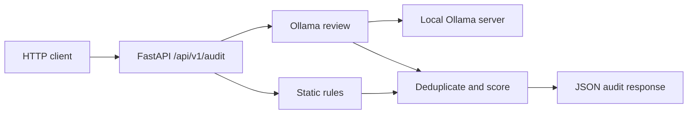

# AIGuardian

AIGuardian is a local code security audit API. Send it a Git patch or code snippet and it combines deterministic rules with a review from a locally running Ollama model. It returns findings, a risk score, and a `PASSED` or `FAILED` result.

This is an MVP for local use. It has no GitHub integration, authentication, rate limiting, database, or web UI. Submitted code is sent to the configured Ollama endpoint, which defaults to your machine.

## How it works



Both passes run for every valid request. Static rules inspect added lines in a Git patch, or every line of a plain snippet. Equivalent findings at the same line are combined, keeping the higher severity. Each `HIGH` adds 40 risk points, `MEDIUM` adds 15, and `LOW` adds 5, capped at 100. Any `HIGH` makes the status `FAILED`; otherwise it is `PASSED`. See the [system design](docs/architecture.md) for the modules, data flow, and failure behavior.

## Requirements

- Python 3.11 or newer
- [Ollama](https://ollama.com/download) with the selected model downloaded
- Enough disk space and memory for that model

The default model is `qwen2.5-coder`. Python dependencies are listed in `requirements.txt`.

## Run locally

Clone the repository and enter its directory:

```bash
git clone https://github.com/Balerion769/ai-guardian.git
cd ai-guardian
```

Create a virtual environment and install dependencies.

**macOS / Linux**

```bash
python3 -m venv .venv
source .venv/bin/activate
python -m pip install -r requirements.txt
```

**Windows PowerShell**

```powershell
py -3 -m venv .venv
.venv\Scripts\Activate.ps1
python -m pip install -r requirements.txt
```

Install Ollama, then download the default model:

```bash
ollama pull qwen2.5-coder
```

Start Ollama if it is not already running as a background service:

```bash
ollama serve
```

In a separate terminal, with the virtual environment active, start the API:

```bash
uvicorn main:app --host 127.0.0.1 --port 8000
```

Open <http://127.0.0.1:8000/docs> for interactive API documentation.

### Configuration

| Variable | Default | Purpose |
| --- | --- | --- |
| `OLLAMA_URL` | `http://localhost:11434/api/generate` | Ollama generation endpoint |
| `OLLAMA_MODEL` | `qwen2.5-coder` | Installed Ollama model name |
| `OLLAMA_TIMEOUT_SECONDS` | `180` | Positive, finite response timeout in seconds |

For example, to use another installed model in PowerShell:

```powershell
ollama pull qwen3-coder:30b
$env:OLLAMA_MODEL = 'qwen3-coder:30b'
uvicorn main:app --host 127.0.0.1 --port 8000
```

On macOS / Linux, set it with `export OLLAMA_MODEL=qwen3-coder:30b` before starting Uvicorn. A larger model needs more resources and may need a longer timeout.

## Use the API

`POST /api/v1/audit` accepts JSON with two required strings:

| Field | Meaning |
| --- | --- |
| `diff_content` | Nonblank Git patch or code snippet, at most 200,000 characters |
| `language` | Nonblank language label, at most 50 characters |

Static rules are language independent; `language` gives the AI model context. Undeclared fields and invalid types are rejected.

**macOS / Linux**

```bash
curl -X POST http://127.0.0.1:8000/api/v1/audit \
  -H 'Content-Type: application/json' \
  -d '{"diff_content":"eval(user_input)","language":"python"}'
```

**Windows PowerShell**

```powershell
$body = @{ diff_content = 'eval(user_input)'; language = 'python' } | ConvertTo-Json
Invoke-RestMethod -Uri 'http://127.0.0.1:8000/api/v1/audit' -Method Post -ContentType 'application/json' -Body $body
```

To audit unstaged Git changes in PowerShell, put the patch in `diff_content`:

```powershell
$patch = git diff --no-ext-diff -- .
$body = @{ diff_content = ($patch -join "`n"); language = 'python' } | ConvertTo-Json
Invoke-RestMethod -Uri 'http://127.0.0.1:8000/api/v1/audit' -Method Post -ContentType 'application/json' -Body $body
```

The patch must be nonempty. Use `git diff --cached` for staged changes.

A response can look like this; Ollama findings can vary:

```json
{
  "status": "FAILED",
  "risk_score": 40,
  "vulnerabilities": [
    {
      "severity": "HIGH",
      "category": "Unsafe Code Execution",
      "description": "Dynamic code execution may run untrusted input.",
      "line_reference": "Line 1",
      "remediation": "Replace dynamic execution with a safe parser or explicit dispatch."
    }
  ],
  "summary": "Found 1 security finding(s)."
}
```

Ollama connection, timeout, or HTTP errors produce HTTP `503`. Invalid model output produces a `FAILED` audit with a `HIGH` severity `Analysis Incomplete` finding; repeat that audit.

## Tests

With the virtual environment active:

```bash
python -m unittest discover -s tests -v
```

Tests use a mock Ollama transport and do not require a running model.

## Current limits and safe use

- Static rules cover selected exposed credentials, `eval`/`exec`, string concatenated SQL, and credential bearing connection strings. They are not a complete security scanner.
- The model can miss issues or report false positives. Review findings before acting on them.
- A clean result means this tool found no issue in the submitted input. It is not a security guarantee.
- The API has no authentication or rate limiting. Keep it bound to `127.0.0.1` or another trusted interface.
- Invalid model responses are logged for diagnosis; configure log access and retention when auditing sensitive code.

## Project layout

```text
main.py                 FastAPI endpoint, merge logic, scoring, error responses
scanner/models.py       Request, response, and finding schemas
scanner/static_rules.py Deterministic added-line rules
scanner/ai_auditor.py   Ollama request and response validation
tests/test_audit.py     API and analysis tests
docs/architecture.md   System design and operational behavior
```
