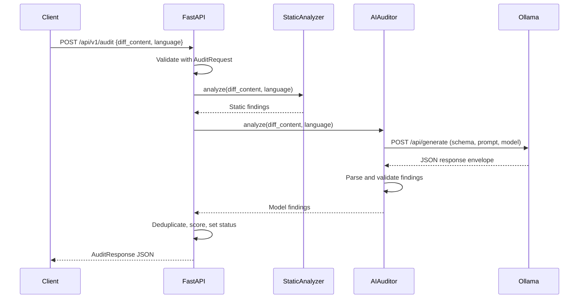

# AIGuardian system design

## Purpose and scope

AIGuardian exposes one local HTTP endpoint to review a Git patch or code snippet for security issues. It runs a deterministic rules pass and a semantic model pass, merges findings, and returns a structured result. It is a single process API with an external Ollama service. There is no persistence or GitHub webhook integration.

## Components

| Component | Responsibility | Dependencies |
| --- | --- | --- |
| `main.py` | Expose `POST /api/v1/audit`, call both passes, deduplicate findings, score risk, map Ollama errors to HTTP 503 | FastAPI, `httpx`, scanner modules |
| `scanner/models.py` | Strictly validate the request, findings, and response | Pydantic |
| `scanner/static_rules.py` | Apply compiled regex rules to added patch lines or all snippet lines | `Vulnerability` model |
| `scanner/ai_auditor.py` | Send input to Ollama and validate its JSON findings | `httpx`, Pydantic, Ollama HTTP API |
| Ollama | Run the selected language model | Downloaded model and machine resources |

## Request path

The calls are sequential: static analysis completes before the Ollama request starts. Each request constructs an `AIAuditor`; without an injected test client it opens an `httpx.AsyncClient` for that model call. No audit is stored after the response.

## Input and output contracts

`AuditRequest` requires nonblank string fields `diff_content` (1 to 200,000 characters) and `language` (1 to 50 characters). Extra fields and implicit type conversions are rejected. The response contains `status`, `risk_score`, `vulnerabilities`, and `summary`. A finding contains `severity`, `category`, `description`, `line_reference`, and `remediation`. Pydantic enforces `HIGH`, `MEDIUM`, or `LOW` severity, `PASSED` or `FAILED` status, and a score between 0 and 100.

## Analysis and decision rules

The static analyzer recognizes a Git patch from `diff --git` or hunk headers. It checks only `+` added lines, skips file headers, and derives new file line numbers from hunk headers. For a snippet, it checks every line. Its rules detect certain credential formats, private keys, hardcoded passwords, unsafe `eval`/`exec`, concatenated SQL calls, and connection strings with embedded credentials. It does not parse the source language; `language` is ignored by this pass.

The AI auditor sends the full submitted text and language to Ollama's `/api/generate` endpoint with `stream: false`, a JSON schema for findings, and temperature 0. The system prompt instructs the model to treat code as data and report only supported security issues introduced by added patch lines. The returned `response` string is parsed as JSON, including a fenced JSON block if present, and validated against the finding schema.

`combine_findings` maps a few equivalent category names (for example, unsafe code execution and code injection) and deduplicates findings with the same normalized category and trailing line number. It keeps the higher severity. This is a heuristic: different descriptions on the same line and category can collapse into one finding, while equivalent issues with different location formats may remain separate.

The score is `min(100, 40 × HIGH + 15 × MEDIUM + 5 × LOW)`. The response is `FAILED` when any retained finding is `HIGH`; otherwise it is `PASSED`. Thus `PASSED` can still include medium or low findings and a nonzero score. The score is a prioritization aid, not a calibrated probability.

## Errors and incomplete analysis

Invalid requests receive FastAPI's validation error response. Ollama transport failures, timeouts, and HTTP errors map to HTTP `503`, so callers can retry after checking the service and model. A successful Ollama HTTP response with invalid or missing findings becomes a `HIGH` severity `Analysis Incomplete` finding. That yields a `FAILED` audit and tells the caller to repeat it; the invalid model text is logged. This prevents a malformed model response from being treated as a clean review.

## Deployment and trust boundaries

The intended deployment is local: a client sends code to FastAPI on `127.0.0.1:8000`; FastAPI sends it to Ollama on `localhost:11434` by default. `OLLAMA_URL` can point elsewhere, in which case submitted code crosses that network boundary. There is no authentication, authorization, rate limiting, or TLS in the app. Exposing the API beyond a trusted host needs those controls at the network or reverse proxy layer. Review log access and retention before auditing private source because malformed Ollama output is logged.

## Testing

`tests/test_audit.py` covers strict request validation, static detection and patch filtering, score capping and deduplication, Ollama schema requests and malformed output, and API success and service failure responses. It uses `httpx.MockTransport` and `ASGITransport`, so automated tests do not require Ollama. Manual end-to-end validation requires a running Ollama model and a request through the local API.
